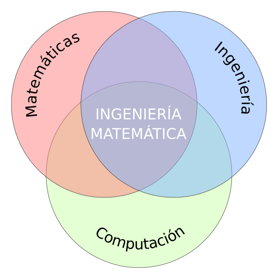

<!-- .slide: data-background="./img/ingenieria-matematica-background.jpg" -->

Grado en  
Ingeniería Matemática

Alfredo Sánchez Alberca <a href="mailto:asalber@ceu.es"><i class='fa fa-envelope'></i></a> <a href="https://twitter.com/aprendeconalf"><i class='fa fa-twitter'></i></a> <a href="https://aprendeconalf.es"><i class='fa fa-home'></i></a>

20 abril 2022

---

## Las Matemáticas están en todas partes

--

## Las Matemáticas están de moda

--

## ¿Por qué están de moda las Matemáticas?

---

## ¿Qué es la Ingeniería Matemática?

---

## Salidas profesionales

<table>
<tbody>
  <tr>
    <td> Banca y Finanzas</td>
    <td> Seguros</td>
    <td> Consultoría</td>
    <td> Comercio electrónico</td>
    <td> Marketing</td>
  </tr>
  <tr>
    <td> Seguridad</td>
    <td> Telecomunicaciones</td>
    <td> Transporte</td>
    <td> Aeronáutica</td>
    <td> Automoción</td>
  </tr>
</tbody>
</table>

--

## Salidas profesionales

<table>
<tbody>
  <tr>
    <td> Logística</td>
    <td> Urbanismo</td>
    <td> Energía</td>
    <td> Medio ambiente</td>
    <td> Meteorología</td>
  </tr>
  <tr>
    <td> Agricultura</td>
    <td> Ganadería</td>
    <td> Medicina</td>
    <td> Ciencia de datos</td>
    <td> Robótica</td>
  </tr>
</tbody>
</table>

---

# Casos de aplicaciones

https://aprendeconalf.es/grado-ingenieria-matematica/#works

---

- [Matemáticas para describir las olas del mar](https://elpais.com/ciencia/2022-04-13/matematicas-para-describir-las-olas-del-mar.html)

