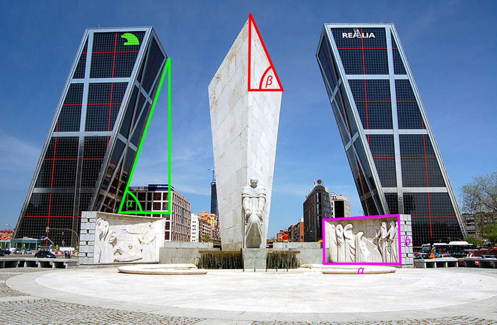

<!-- .slide: data-background="./img/ingenieria-matematica-background.jpg" -->

Grado en  
Ingeniería Matemática

Alfredo Sánchez Alberca <a href="mailto:asalber@ceu.es"><i class='fa fa-envelope'></i></a> <a href="https://twitter.com/aprendeconalf"><i class='fa fa-twitter'></i></a> <a href="https://aprendeconalf.es"><i class='fa fa-home'></i></a>

20 abril 2022

---

## Las Matemáticas están en todas partes

--

## Las Matemáticas están de moda

--

## ¿Por qué están de moda las Matemáticas?

---

## ¿Qué es la Ingeniería Matemática?

--

## Lenguajes de programación

---

## Plan de Estudios

### Primer curso

**Primer Semestre**

| Asignatura | ECTS |
|:-|-:|
| Fundamentos de Matemáticas | 3 |
| Análisis I | 6 |
| Álgebra Lineal | 9 |
| Matemática Discreta | 6 |
| Programación | 6 |

**Segundo Semestre**

| Asignatura | ECTS |
|:-|-:|
| Análisis II | 6 |
| Probabilidad y Estadística | 6 |
| Algoritmos y Estructuras de Datos | 9 |
| Claves de Historia Contemporánea | 6 |
| Proyecto 1 | 3 |

--

## Plan de Estudios

### Segundo curso

**Primer Semestre**

| Asignatura | ECTS |
|:-|-:|
| Análisis III | 6 |
| Ecuaciones Diferenciales y en Diferencias | 6 |
| Bases de Datos | 6 |
| Estadística Inferencial | 6 |
| Fundamentos Económicos | 6 |

**Segundo Semestre**

| Asignatura | ECTS |
|:-|-:|
| Geometría Diferencial | 6 |
| Métodos Numéricos I | 6 |
| Electrónica Digital y Arquitectura de Ordenadores | 9 |
| Ecuaciones en Derivadas Parciales | 6 |
| Análisis de Datos | 6 |
| Proyecto 2 | 3 |

--

## Plan de Estudios

### Tercer curso (Mención Finanzas)

**Primer Semestre**

| Asignatura | ECTS |
|:-|-:|
| Sistemas Operativos y Redes de Ordenadores | 6 |
| Optimización | 6 |
| Métodos Numéricos II | 6 |
| Homrbre y Mundo Moderno | 6 |
| Optativas | 6 |

**Segundo Semestre**

| Asignatura | ECTS |
|:-|-:|
| Cálculo Estocástico | 6 |
| Matemática Financiera I | 6 |
| Matemáticas Actuariales | 6 |
| Aprendizaje Automático | 6 |
| Computación en Paralelo | 6 |

--

## Plan de Estudios

### Tercer curso (Mención Inteligencia Artificial)

**Primer Semestre**

| Asignatura | ECTS |
|:-|-:|
| Sistemas Operativos y Redes de Ordenadores | 6 |
| Optimización | 6 |
| Métodos Numéricos II | 6 |
| Hombre y Mundo Moderno | 6 |
| Optativas | 6 |

**Segundo Semestre**

| Asignatura | ECTS |
|:-|-:|
| Lógica Formal | 6 |
| Teoría de la Computación | 6 |
| Fundamentos de la Inteligencia Artificial | 6 |
| Aprendizaje Automático | 6 |
| Computación en Paralelo | 6 |

--

## Plan de Estudios

### Tercer curso

**Optativas**

| Asignatura | ECTS |
|:-|-:|
| Análisis Funcional | 3 |
| Sistemas Dinámicos | 3 |
| Topología | 3 |
| Variable Compleja y Análisis de Fourier | 6 |

--

## Plan de Estudios

### Cuarto curso (Mención Finanzas)

**Primer Semestre**

| Asignatura | ECTS |
|:-|-:|
| Matemática Financiera II | 6 |
| Minería de Datos y Big Data | 6 |
| Modelos de Riesgo Cuantitativo | 6 |
| Teoría y Optimización de Carteras | 6 |
| Series Temporales | 6 |

**Segundo Semestre**

| Asignatura | ECTS |
|:-|-:|
| Doctrina Social de la Iglesia | 6 |
| Optativa | 3 |
| Prácticas Externas | 12 |
| Trabajo Fin de Grado | 9 |

--

## Plan de Estudios

### Cuarto curso (Mención Finanzas)

**Optativas**

| Asignatura | ECTS |
|:-|-:|
| Criptografía y Blockchain | 3 |
| Procesos Estocásticos | 3 |
| Aprendizaje Profundo | 3 |
| Computación Cuántica | 3 |
| Grandes Libros | 3 |
| Ética y Deontología | 3 |

--

## Plan de Estudios

### Cuarto curso (Mención Inteligencia Artificial)

**Primer Semestre**

| Asignatura | ECTS |
|:-|-:|
| Programación Lógica | 6 |
| Programación Funcional | 6 |
| Percepción Computacional | 6 |
| Procesamiento del Lenguaje Natural | 6 |
| Administración de Sistemas | 6 |

**Segundo Semestre**

| Asignatura | ECTS |
|:-|-:|
| Doctrina Social de la Iglesia | 6 |
| Optativa | 3 |
| Prácticas Externas | 12 |
| Trabajo Fin de Grado | 9 |

--

## Plan de Estudios

### Cuarto curso (Mención Inteligencia Artificial)

**Optativas**

| Asignatura | ECTS |
|:-|-:|
| Ingeniería del Software | 3 |
| Teoría de la Señal | 3 |
| Aprendizaje Profundo | 3 |
| Computación Cuántica | 3 |
| Grandes Libros | 3 |
| Ética y Deontología | 3 |

---

## Salidas profesionales

<table>
<tbody>
  <tr>
    <td> Banca y Finanzas</td>
    <td> Seguros</td>
    <td> Consultoría</td>
    <td> Comercio electrónico</td>
    <td> Marketing</td>
  </tr>
  <tr>
    <td> Seguridad</td>
    <td> Telecomunicaciones</td>
    <td> Transporte</td>
    <td> Aeronáutica</td>
    <td> Automoción</td>
  </tr>
</tbody>
</table>

--

## Salidas profesionales

<table>
<tbody>
  <tr>
    <td> Logística</td>
    <td> Urbanismo</td>
    <td> Energía</td>
    <td> Medio ambiente</td>
    <td> Meteorología</td>
  </tr>
  <tr>
    <td> Agricultura</td>
    <td> Ganadería</td>
    <td> Medicina</td>
    <td> Ciencia de datos</td>
    <td> Robótica</td>
  </tr>
</tbody>
</table>

---

# Casos de aplicaciones

https://aprendeconalf.es/grado-ingenieria-matematica/#works

---
<!-- 
- [Matemáticas para describir las olas del mar](https://elpais.com/ciencia/2022-04-13/matematicas-para-describir-las-olas-del-mar.html) -->

